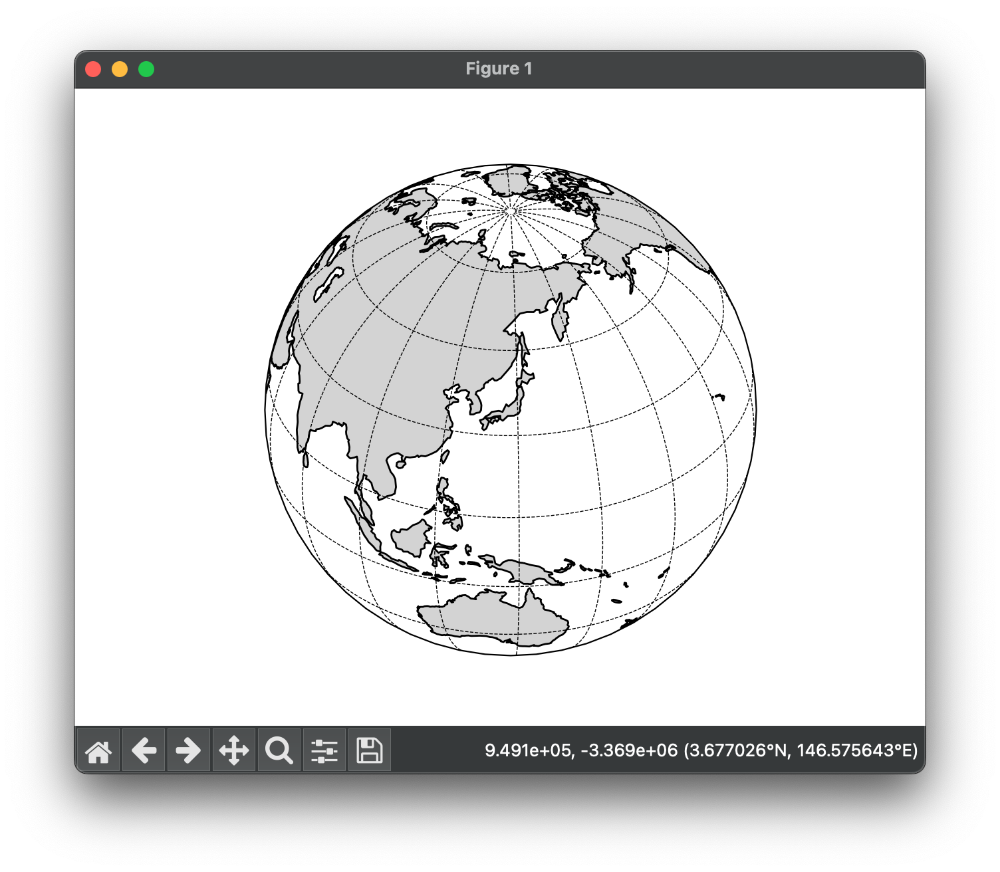

# draw_a_globe
draw a globe (Earth).

Requires the following packages :
```
pip install geos
pip install shapely
pip install pyshp
pip install numpy

brew install geos # for macOS

pip install cartopy
```


